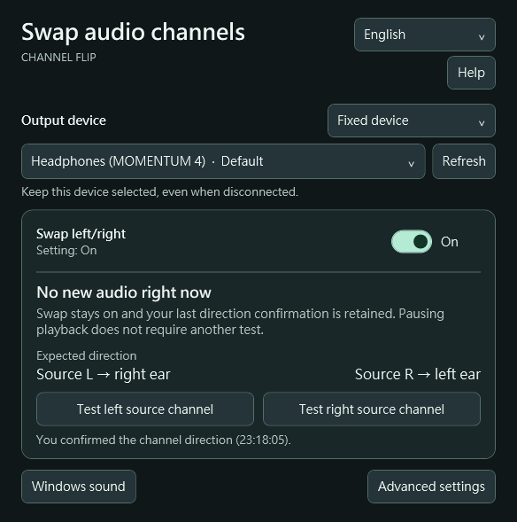

# Channel Flip

[繁體中文](README.md) | **English**

[](https://github.com/henry3218/ChannelFlip/actions/workflows/build.yml)
[](https://github.com/henry3218/ChannelFlip/releases/latest)
[](LICENSE)

Swap the left and right channels of your headphones or speakers on Windows. Windows has no such switch of its own. Channel Flip works at the system level, so it does not depend on each player having its own option, and it does not need Equalizer APO installed.

**Useful when**

- You have hearing loss on one side, or one earcup has failed, and you want the sound moved to the ear you can hear with
- The cable or connector on your headphones or speakers is wired backwards
- The audio itself is reversed (old recordings, transfers, an editing mistake)
- Your player, game or meeting app offers no left/right swap

<p align="center">
  
</p>

## Download

### [Download 2.3.0 (Windows x64 ZIP)](https://github.com/henry3218/ChannelFlip/releases/download/v2.3.0/ChannelFlip-2.3.0-windows-x64.zip)

`SHA256` `7f96abc3f842fd3be74480df86b8647fd08033e6af16b4f6fdcbb07c021a82de`

[Release notes](https://github.com/henry3218/ChannelFlip/releases/tag/v2.3.0) · [Security and verification](#security-and-verification) · [Report an issue](https://github.com/henry3218/ChannelFlip/issues)

> [!IMPORTANT]
> This release has no Microsoft audio signature. First-time setup requires administrator approval, briefly interrupts computer audio, and disables the protected audio host's signature restriction system-wide. This may affect DRM playback, and the change stays in place until you undo it. [Review the full list of changes and how to restore them](FIRST_RUN.en.md).

## Get started

1. **Open the app:** Extract the download and run `ChannelFlip.exe`.
2. **Set up a device:** Select your headphones or speakers, choose **Set up this device**, and follow the on-screen steps.
3. **Check the direction:** Turn on **Swap left/right** and use both test buttons. The left source should reach your right ear; the right source should reach your left ear.

Swapping stays active after you close the window. Turn off **Swap left/right** to restore the original direction. To undo system changes, choose **Advanced settings → Remove all device settings**.

Switch between **English and Traditional Chinese** at the top right. The app remembers your choice.

## Security and verification

This app asks for administrator rights and changes system-wide audio settings, so confirm you received the file you expected.

**Check the download's hash** in PowerShell:

```powershell
Get-FileHash .\ChannelFlip-2.3.0-windows-x64.zip -Algorithm SHA256
```

It should match the `SHA256` above and the `.sha256.txt` attached to the release. You can also upload the file to [VirusTotal](https://www.virustotal.com/gui/home/upload) and scan it yourself.

**About the SmartScreen warning:** the executable is not yet code-signed, so Windows shows "Windows protected your PC." See the [signing notes](docs/SIGNING.en.md) for the current state and the plan.

**If you would rather not trust a binary, build it yourself.** The source is fully public, the build steps are below, and every push runs the complete build and test suite on GitHub Actions.

**Why administrator rights are needed:** installing a custom audio processing object (APO) requires writing to the system registry and restarting the audio service. Every value that gets modified, how it is backed up, and how to restore it are listed in [FIRST_RUN.en.md](FIRST_RUN.en.md). The app also shows you the full scope of the change before it applies anything.

## Compatibility

- **Requirements:** Windows 10 / 11 x64 with .NET Framework 4.6.2 or later.
- **Tested:** Windows 11 with MOMENTUM 4. Windows 10, other devices and actual sleep/resume remain unvalidated.
- **Audio paths:** Audio must pass through Windows shared-mode effects. ASIO, exclusive mode, RAW, passthrough, or disabled audio enhancements may bypass swapping.

[View compatibility and test results](VALIDATION.en.md)

## Build and contribute

Run in 64-bit PowerShell on Windows x64:

```powershell
.\tools\bootstrap.ps1
.\build.ps1 -Test
```

The output is `app/ChannelFlip.exe`. [Build and contribution guide](CONTRIBUTING.md) · [Release process](docs/RELEASING.md)

## License

[MIT](LICENSE). Include `LICENSE` and [third-party notices](THIRD_PARTY_NOTICES.txt) when redistributing.
