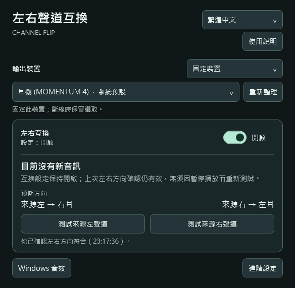

# Channel Flip

**繁體中文** | [English](README.en.md)

[](https://github.com/henry3218/ChannelFlip/actions/workflows/build.yml)
[](https://github.com/henry3218/ChannelFlip/releases/latest)
[](LICENSE)

在 Windows 上交換耳機或喇叭的左右聲道。Windows 本身沒有這個開關，而 Channel Flip 在系統層級處理，不必依賴播放程式自己的選項，也不需要安裝 Equalizer APO。

**適合這些情況**

- 單邊聽力受損，或耳機有一邊壞掉，想把聲音移到聽得到的那一耳
- 耳機、喇叭的線材或接頭左右接反
- 音檔本身左右顛倒（舊錄音、轉錄檔、剪輯失誤）
- 播放程式、遊戲或會議軟體沒有提供左右互換選項

<p align="center">
  
</p>

## 下載

### [下載 2.3.0 正式版（Windows x64 ZIP）](https://github.com/henry3218/ChannelFlip/releases/download/v2.3.0/ChannelFlip-2.3.0-windows-x64.zip)

`SHA256` `7f96abc3f842fd3be74480df86b8647fd08033e6af16b4f6fdcbb07c021a82de`

[版本說明](https://github.com/henry3218/ChannelFlip/releases/tag/v2.3.0) · [安全性與驗證](#安全性與驗證) · [回報問題](https://github.com/henry3218/ChannelFlip/issues)

> [!IMPORTANT]
> 此版本尚未取得微軟音訊簽章。首次設定需管理員權限，會短暫中斷電腦音訊，並停用全系統受保護音訊宿主的簽章限制，可能影響 DRM 內容播放。這項變更在你手動還原前會一直存在。[查看完整變更與還原方式](FIRST_RUN.md)。

## 開始使用

1. **開啟程式**：解壓縮下載檔，執行 `ChannelFlip.exe`。
2. **設定裝置**：選擇耳機或喇叭，按「設定此裝置」，依畫面說明完成設定。
3. **確認方向**：開啟「左右互換」，按左右測試鍵，確認左聲道從右耳、右聲道從左耳聽到。

關閉視窗後，互換仍有效。要恢復原方向，關閉「左右互換」；要還原系統變更，選擇「進階設定 → 移除所有裝置的設定」。

右上角可切換 **繁體中文／English**，程式會記住選擇。

## 安全性與驗證

這個程式會要求管理員權限，並修改全系統的音訊設定，所以請先確認你拿到的是預期中的檔案。

**核對下載檔的雜湊值**，在 PowerShell 執行：

```powershell
Get-FileHash .\ChannelFlip-2.3.0-windows-x64.zip -Algorithm SHA256
```

結果應與上方的 `SHA256`、以及版本頁附的 `.sha256.txt` 一致。你也可以把檔案上傳到 [VirusTotal](https://www.virustotal.com/gui/home/upload) 自行掃描。

**關於 SmartScreen 警告**：執行檔尚未經過程式碼簽署，Windows 會顯示「已保護您的電腦」。簽署的現況與計畫見[簽署說明](docs/SIGNING.md)。

**不信任二進位檔的話可以自己建置**：原始碼完整公開，建置流程見下方，每次推送都會在 GitHub Actions 跑完整建置與測試。

**需要管理員權限的原因**：安裝自製音訊核心（APO）必須寫入系統登錄並重啟音訊服務。所有會被修改的項目、備份方式與還原步驟，逐項列在 [FIRST_RUN.md](FIRST_RUN.md)；程式在執行前也會把影響範圍顯示出來讓你確認。

## 支援範圍

- **系統需求**：Windows 10 / 11 x64，.NET Framework 4.6.2 以上。
- **實測環境**：Windows 11 + MOMENTUM 4。Windows 10、其他裝置與真正睡眠／喚醒尚未完成驗收。
- **音訊限制**：需經過 Windows 共用模式音效。ASIO、獨佔模式、RAW、音訊直通或關閉音效強化時，互換可能無效。

[查看相容性與測試紀錄](VALIDATION.md)

## 開發與貢獻

在 Windows x64 的 64 位元 PowerShell 執行：

```powershell
.\tools\bootstrap.ps1
.\build.ps1 -Test
```

輸出位於 `app/ChannelFlip.exe`。[建置與貢獻指南](CONTRIBUTING.md) · [發布流程](docs/RELEASING.md)

## 授權

[MIT](LICENSE)。散布時請保留 `LICENSE` 與 [第三方授權聲明](THIRD_PARTY_NOTICES.txt)。
